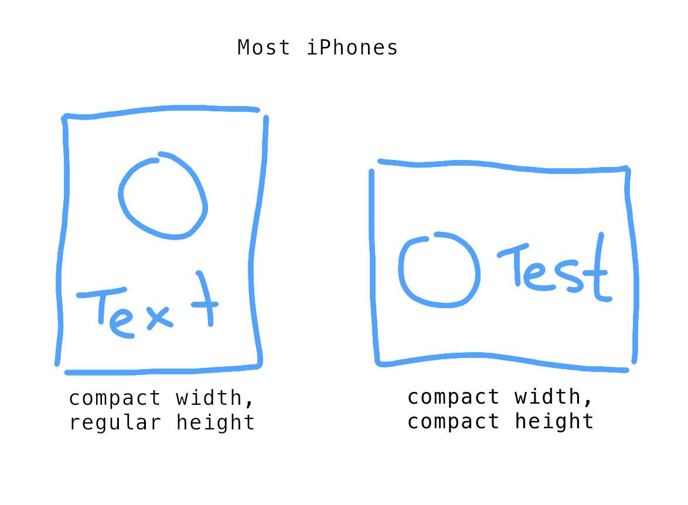

# Adaptive Dog

A demonstration of creating UI around Size Classes.

A successor to the original SizeDog sample.

## Abstract

All `UIViewController`s know their current Size Class, within their `traitCollection` property. 

Size Classes can be broken up into two categories: Compact and Regular.

These can be inferred with `traitCollection.horizontalSizeClass` and `traitCollection.verticalSizeClass`.

Any `UIViewController` can [respond to orientation changes by overriding the function](https://developer.apple.com/documentation/uikit/uitraitenvironment/1623516-traitcollectiondidchange): 

```swift
func traitCollectionDidChange(_ previousTraitCollection: UITraitCollection?)
```

## Objective:

I want to orient an image and some text like in this picture:



## References

[A nice StackOverflow reference](https://stackoverflow.com/questions/25685829/programmatically-implementing-two-different-layouts-using-size-classes)

[Size Classes](https://developer.apple.com/design/human-interface-guidelines/ios/visual-design/adaptivity-and-layout/)

[WWDC 2016 - Making Apps Adaptive, Part 1](https://developer.apple.com/videos/play/wwdc2016/222/)

[Remy](https://movies.disney.com/ratatouille/characters)